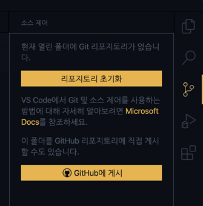
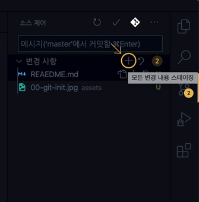
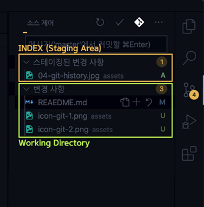
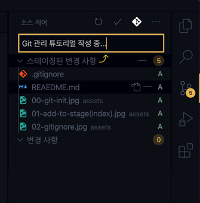
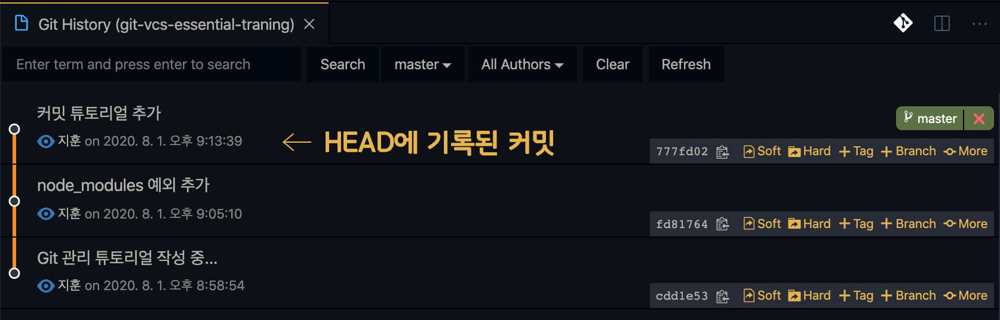
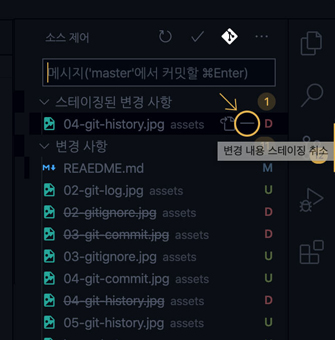
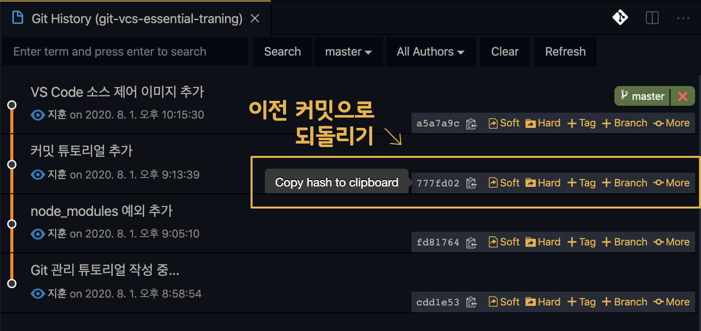
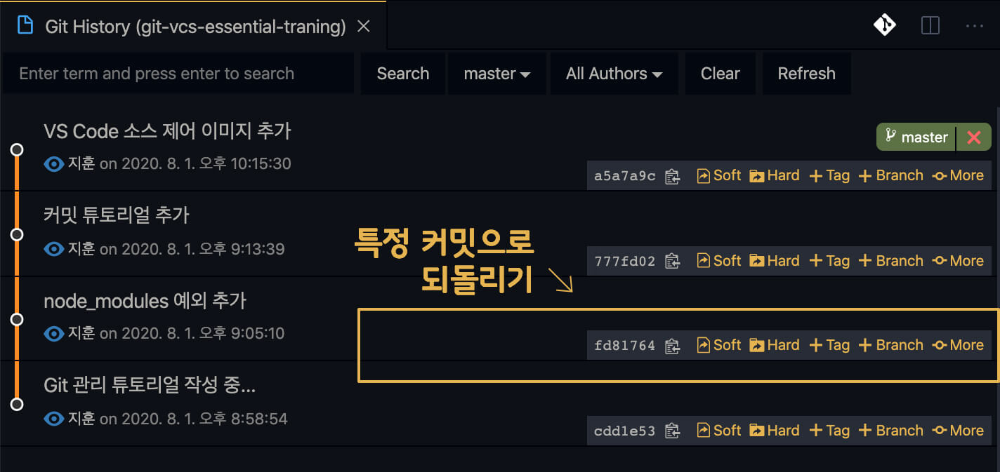

[← 뒤로](./README.md)

#  Git 버전 관리 에센셜 PART 03

Git을 사용해 프로젝트 버전 관리하는 방법을 살펴봅니다. CLI와 GUI 환경에서 Git을 사용하는 방법을 비교해봅니다.

<a href="https://bit.ly/GIT_ESSENTIAL" target="_blank"></a>

<!-- ----------------------------------------------------------------------- -->


##  Git 초기화

프로젝트를 Git으로 관리하려면 초기화 과정이 필요합니다.

#### CLI 명령어 환경 —

`init` 명령을 사용해 초기화(Initialization) 할 수 있습니다.


```sh
$ git init
```

#### GUI 그래픽 환경 —

Visual Studio Code 에디터 소스 제어의 화면에 관리 상태가 표시되므로 워킹 디렉토리, 인덱싱 된 파일을 확인할 수 있습니다.




<!-- ----------------------------------------------------------------------- -->


##  Index에 추가

워킹 디렉토리(Project Folder)에서 스테이징 에이리어로 인덱싱(Index)하는 방법을 살펴봅니다.

#### CLI 명령어 환경 —

워킹 디렉토리에서 스테이징 에이리어로 인덱싱 하려면 `add` 명령을 사용합니다.

```sh
$ git add .
```

특정 파일만 인덱싱 하려면 "파일_이름"을 명시적으로 추가하여 명령을 실행합니다.

```sh
$ git add <파일_이름>
```

#### GUI 그래픽 환경 —

Visual Studio Code 에디터 소스 제어의 화면에 관리 상태가 표시되므로 워킹 디렉토리, 인덱싱 된 파일을 확인할 수 있습니다.
파일 이름 옆에 위치한 `+` 버튼을 클릭해 특정 파일만 스테이징 에이리어에 인덱싱 할 수도 있습니다.




<!-- ----------------------------------------------------------------------- -->


##  관리 상태 확인

관리 중인 버전의 상태를 확인하는 방법을 살펴봅니다.

#### CLI 명령어 환경 —

현재 관리 중인 상태를 확인하려면 `status` 명령을 사용합니다.

```sh
$ git status
```

명령이 실행되면 현재 관리 중인 버전 상태가 출력됩니다.

```sh
On branch master
Changes to be committed:
  (use "git restore --staged <file>..." to unstage)
        new file:   assets/04-git-history.jpg

Changes not staged for commit:
  (use "git add <file>..." to update what will be committed)
  (use "git restore <file>..." to discard changes in working directory)
        modified:   REAEDME.md

Untracked files:
  (use "git add <file>..." to include in what will be committed)
        assets/02-git-log.jpg
        assets/icon-git-1.png
        assets/icon-git-2.png
```

#### GUI 그래픽 환경 —

Visual Studio Code 에디터 소스 제어를 통해 워킹 디렉토리(`변경 사항`), 인덱싱(`스테이징 된 변경 사항`) 된 파일을 확인할 수 있습니다.




<!-- ----------------------------------------------------------------------- -->


##  HEAD에 커밋

인덱싱 된 파일을 헤드(HEAD)에 커밋(확정)하는 방법을 학습합니다.

#### CLI 명령어 환경 —

인덱스(Index)에 추가 된 변경사항을 HEAD에 확정(기록) 하려면 `commit` 명령을 사용합니다.

```sh
$ git commit -m "확정(commit) 메시지 작성"
```

#### GUI 그래픽 환경 —

Visual Studio Code 에디터 소스 제어 화면의 `메시지` 입력 영역에 커밋 메시지를 작성하고 `✔︎` 버튼을 클릭해 등록합니다.



<!-- ----------------------------------------------------------------------- -->


##  HEAD에 기록 된 커밋

버전 관리 중인 히스토리를 확인하는 방법을 학습합니다.

#### CLI 명령어 환경 —

버전 관리 중인 히스토리를 확인하려면 `log` 명령을 사용합니다.

```sh
$ git log
```

그래프 또는 한 줄로 히스토리를 표시하려면 `--graph`, `--oneline` 옵션 플래그를 추가합니다.

```sh
$ git log --graph --oneline
```

#### GUI 그래픽 환경 —

[Git History](https://marketplace.visualstudio.com/items?itemName=donjayamanne.githistory) 익스텐션을 설치한 후, 
Visual Studio Code 소스 제어 화면의  버튼을 누르면 Git History가 에디터에 표시됩니다.




<!-- ----------------------------------------------------------------------- -->


##  스테이징 취소

인덱싱 되어 관리 중인 파일을 워킹 디렉토리로 되돌리는 방법을 학습합니다.

#### CLI 명령어 환경 —

인덱스에 추가 된 변경사항을 언 스테이지(Working Directory)로 되돌리려면 `restore` 명령을 사용합니다.

```sh
$ git restore
```

특정 파일만 스테이징 취소하려면 `파일_이름`을 명시적으로 작성합니다.

```sh
$ git restore <파일_이름>
```

#### GUI 그래픽 환경 —

Visual Studio Code 소스 제어 화면에서 스테이징 된 변경 사항의 파일 이름 옆의 `-` 버튼을 누르면 스테이징 취소 됩니다.




<!-- ----------------------------------------------------------------------- -->


##  마지막 커밋 취소

마지막 커밋으로 되돌리는 방법을 살펴봅니다.

#### CLI 명령어 환경 —

최종 커밋 된 내용을 취소하려면 `reset --soft HEAD^` 명령을 사용합니다.

```sh
$ git reset --soft HEAD^
```

#### GUI 그래픽 환경 —

Git History 화면에 출력 된 커밋 내용 중 되돌릴 커밋 이름 옆의 `Soft` 또는 `Hard` 버튼을 눌러 되돌릴 수 있습니다.




<!-- ----------------------------------------------------------------------- -->


##  특정 커밋 위치로 되돌리기

특정 커밋으로 되돌리는 방법을 살펴봅니다.

#### CLI 명령어 환경 —

기록 된 커밋의 특정 위치(커밋 해시) 값을 입력해 되돌릴 수 있습니다.

```sh
# 커밋을 되돌리되, 변경 내용은 유지
$ git reset --soft 7cc40cf

# 커밋을 되돌리면서 변경 내용 모두 제거
$ git reset --hard 7cc40cf
```

#### GUI 그래픽 환경 —

Git History 화면에 출력 된 커밋 내용 중 되돌릴 특정 커밋 이름 옆의 `Soft` 또는 `Hard` 버튼을 눌러 되돌릴 수 있습니다.

