[← 뒤로](./README.md)

#  Git 버전 관리 에센셜 PART 04

Git을 사용해 프로젝트 버전 관리하는 방법을 살펴봅니다. CLI와 GUI 환경에서 Git을 사용하는 방법을 비교해봅니다.

<a href="https://bit.ly/GIT_ESSENTIAL" target="_blank"></a>


<!-- ----------------------------------------------------------------------- -->


##  마지막 커밋 메시지 수정하기

간혹 커밋 된 메시지를 보면 오타가 포함될 수 있습니다. 이런 경우 [PART 03](./PART03.md)에서 살펴봤던 `reset --soft` 명령을 사용해 커밋을 되돌린 후 오타를 수정할 수 있지만, 단순히 커밋 메시지의 오타만 수정하는 경우라면 메시지만 수정 할 수도 있습니다.

#### CLI 명령어 환경 —

`--amend` 명령을 사용해 마지막 커밋의 메시지를 수정할 수 있습니다.

```sh
$ git commit --amend -m <"수정할 커밋 메시지">
```


#### GUI 그래픽 환경 —

VSCode에서 이전 커밋 메시지의 오타를 수정하려면 파일을 먼저 수정해야 합니다. 
공백 등을 추가한 다음 변경( `M` )이 감지되도록 만듭니다.

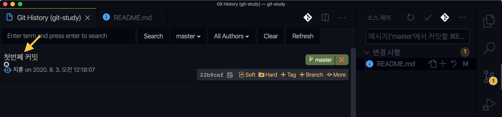

VSCode 사이드바의 `소스 제어` 창의 컨텍스트 메뉴 `...` 버튼을 누른 다음 `스테이징된 항목 커밋(수정)` 버튼을 찾아 클릭합니다.

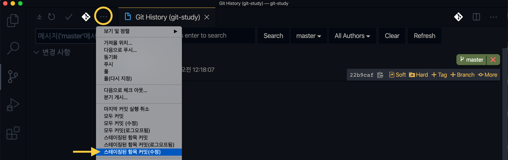

커밋 메시지 입력 창이 에디터 상단에 표시되면 수정할 메시지를 입력하고 저장합니다.

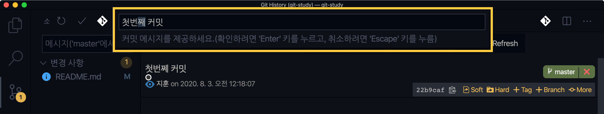

소스 제어 창에 표시된 이전 커밋 메시지를 확인하면 오타가 정정된 것을 볼 수 있습니다.

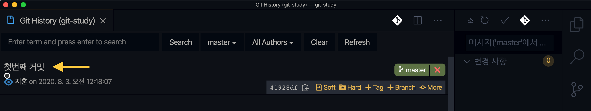

<br>

<!-- ----------------------------------------------------------------------- -->


##  원격 저장소 등록하기

Git으로 버전 관리한 프로젝트(Local Repository)를 Github 원격 저장소(Remote Repository)로 푸시(Push) 하려면? 원격 저장소를 먼저 생성한 후, 프로젝트에 원격 저장소를 등록해야 합니다.

#### CLI 명령어 환경 —

`remote add` 명령을 사용해 원격 저장소를 등록 할 수 있습니다.

```sh
$ git remote add origin <https://github.com/사용자ID/프로젝트_이름.git>
```


#### GUI 그래픽 환경 —

본인의 [Github](https://github.com) 계정에 새로운 원격 저장소를 만듭니다.

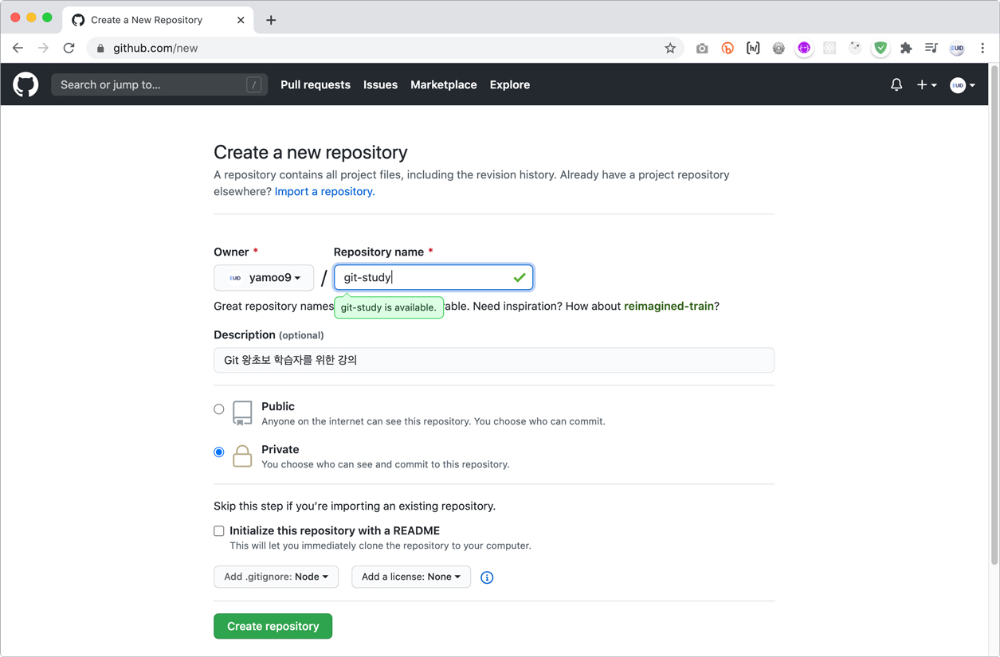

생성된 원격 저장소의 `Code` 버튼을 누른 후, HTTPS 주소를 복사합니다.

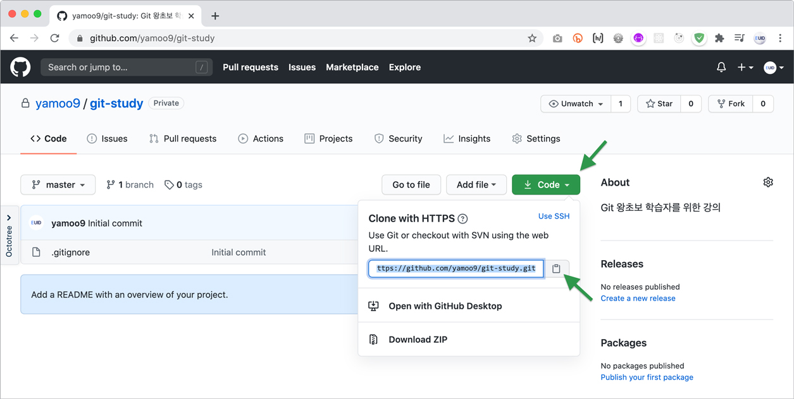

현재 VSCode는 별도로 원격 저장소를 추가하는 버튼을 제공하고 있지 않습니다.
이런 경우 명령어 팔레트( `F1` )를 연 후, `git add remote`라고 입력하여 **Git: 원격 추가...** 명령을 찾아 실행합니다.

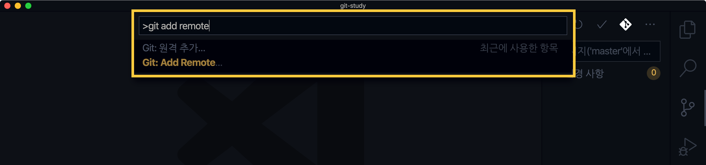

복사해 둔 Github 원격 저장소 URL을 입력 창에 붙여 넣고 실행합니다.

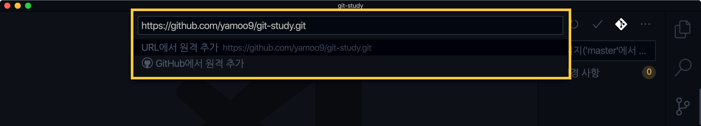

원격 저장소의 별칭(alias) 이름을 기입한 후 실행하면 원격 저장소 등록이 완료됩니다.

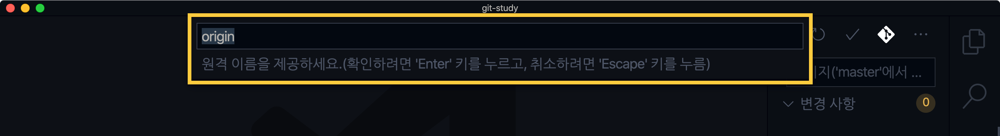

<br>

<!-- ----------------------------------------------------------------------- -->


##  원격 저장소 조회하기

로컬 저장소인 프로젝트 폴더에 등록한 원격 저장소를 조회 할 수 있습니다.

#### CLI 명령어 환경 —

`remote -v` 명령을 사용해 원격 저장소를 조회 할 수 있습니다.

```sh
$ git remote -v
```

#### GUI 그래픽 환경 —

VSCode에 별도로 원격 저장소를 조회할 수 있는 버튼을 제공하지는 않습니다.
원격 저장소 등록이 성공적으로 수행되었는지 확인하고자 한다면? 소스제어 컨텍스트 메뉴를 표시하는 `...` 버튼을 클릭한 후
`다음으로 푸시...` 버튼을 찾아 클릭합니다.


그러면 등록 된 원격 저장소 별칭 이름과 URL을 목록에 표시합니다.


<br>

<!-- ----------------------------------------------------------------------- -->


##  원격 저장소 삭제하기

로컬 프로젝트 폴더에는 여러개의 원격 저장소를 등록할 수 있으며 이 중에서 불필요해진 원격 저장소는 삭제할 수 있습니다.

#### CLI 명령어 환경 —

`remote rm` 명령을 사용해 원격 저장소를 삭제 할 수 있습니다.

```sh
$ git remote rm origin
```

#### GUI 그래픽 환경 —

VSCode에 별도로 등록된 원격 저장소를 제거하는 버튼을 제공하지는 않습니다.
등록된 원격 저장소 제거하려면? 명령어 팔레트( `F1` )를 연 후, `git remove remote`라고 입력하여 **Git: 원격 제거...** 명령을 찾아 실행합니다.


등록된 원격 저장소 목록이 표시되면 제거할 원격 저장소 별칭 이름을 입력 또는 찾아 클릭해 등록된 원격 저장소를 제거할 수 있습니다.


<br>

<!-- ----------------------------------------------------------------------- -->


##  원격 저장소로 백업하기

Git으로 버전 관리한 파일을 로컬 저장소 이외의 원격 저장소로 백업 할 수 있습니다. 이때 원격 저장소는 다른 사람과 협업을 할 때 매우 유용하게 활용할 수 있으며 인터넷이나 네트워크 어딘가에 있는 저장소를 말합니다. 대표적인 원격 저장소를 제공하는 서비스로는 [Github](https://github.com), [Gitlab](https://gitlab.com), [Bitbucket](https://bitbucket.org/) 등이 있습니다.

#### CLI 명령어 환경 —

`remote push` 명령을 사용해 원격 저장소로 버전 관리한 프로젝트를 푸시(Push) 할 수 있습니다.

```sh
$ git push origin master
```

#### GUI 그래픽 환경 —

소스제어 창의 컨텍스트 메뉴를 열어 `다음으로 푸시...` 버튼을 클릭합니다.


등록된 원격 저장소를 목록에서 찾아 선택하여 원격 저장소에 푸시(Push) 합니다.


Git 버전 관리 이력(History) 보면 `origin/master` 태그가 표시되어 성공적으로 원격 저장소에 푸시 되었음을 알려줍니다.

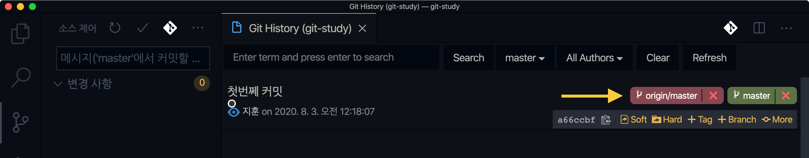

GitHub 원격 저장소에도 푸시한 프로젝트가 반영되었음을 확인할 수 있습니다.

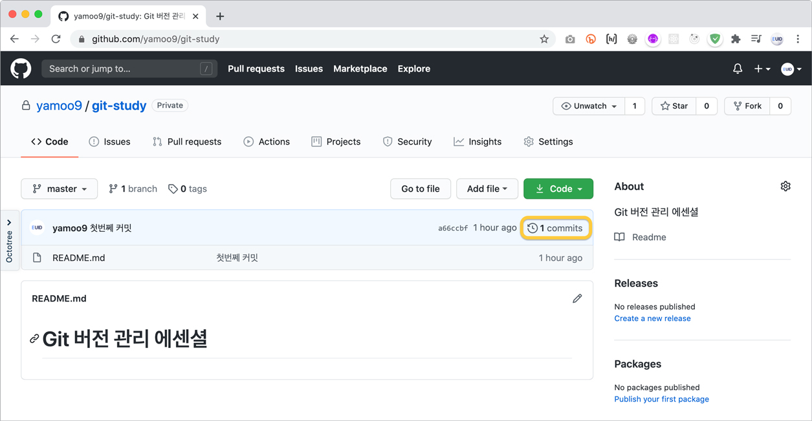

<br>

<!-- ----------------------------------------------------------------------- -->
