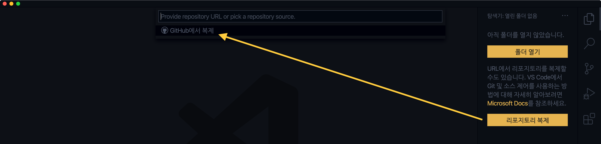
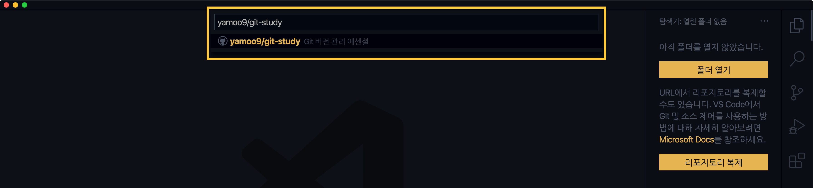
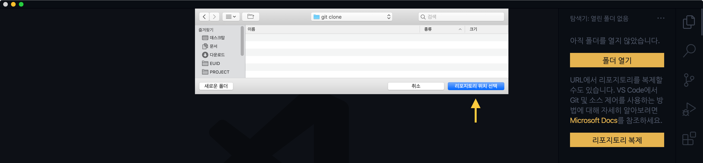
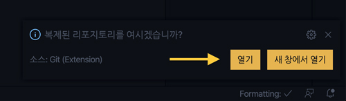
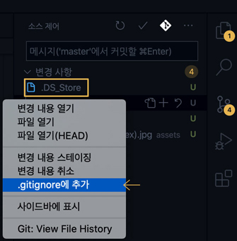
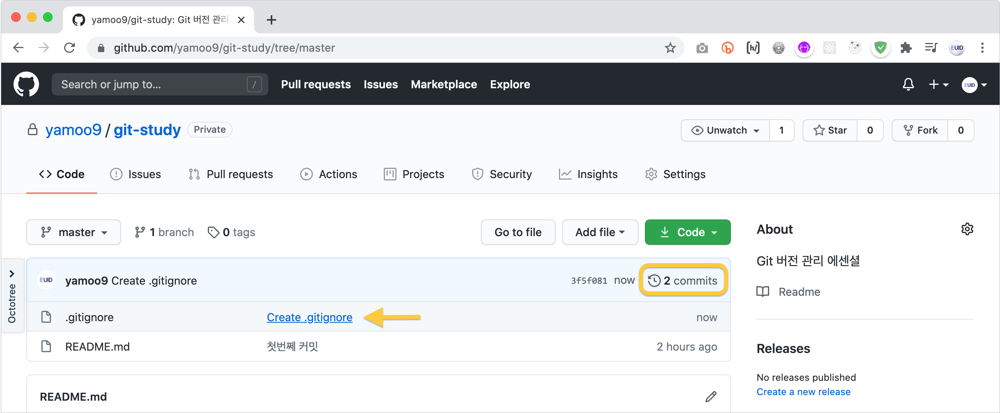
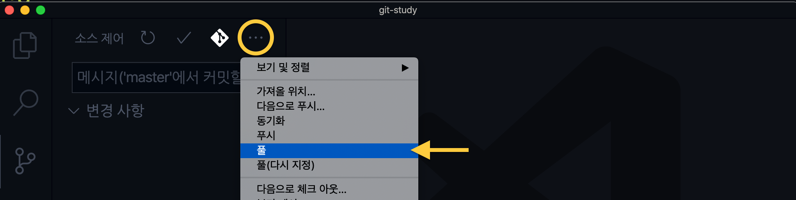
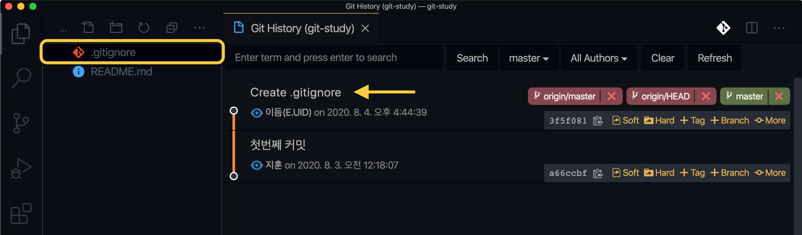

[← 뒤로](./README.md)

#  Git 버전 관리 에센셜 PART 05

Git을 사용해 프로젝트 버전 관리하는 방법을 살펴봅니다. CLI와 GUI 환경에서 Git을 사용하는 방법을 비교해봅니다.

<a href="https://bit.ly/GIT_ESSENTIAL" target="_blank"></a>


<!-- ----------------------------------------------------------------------- -->


##  원격 저장소에서 로컬로 복제하기

원격 저장소에 있는 소스 및 버전 관리 자료를 로컬 저장소로 복제 할 수 있습니다.

#### CLI 명령어 환경 —

`clone` 명령을 사용해 원격 저장소의 프로젝트를 복제 할 수 있습니다.

```sh
$ git clone <https://github.com/사용자ID/프로젝트폴더.git>
```


#### GUI 그래픽 환경 —

에디터를 `새 창`으로 연 후, 사이드 패널의 `리포지토리 복제` 버튼을 누른 후, `GitHub에서 복제`를 선택합니다.



복제 할 원격 저장소를 검색한 후 선택합니다.



복제를 수행할 로컬 폴더 위치를 선택하고 `리포지토리 위치 선택` 버튼을 클릭합니다.



복제가 완료되면 에디터 우측 하단에 알림이 표시됩니다. 에디터에서 복제된 프로젝트를 열려면 `열기` 버튼을 누릅니다.



<br>

<!-- ----------------------------------------------------------------------- -->


##  관리 예외 추가

버전 관리에서 제외 할 예외를 추가하는 방법을 살펴봅니다.

#### CLI 명령어 환경 —

버전 관리에서 제외 할 예외를 추가하려면 `.gitignore` 파일을 생성해야 합니다.

```sh
$ code .gitignore
```

생성된 `.gitignore` 파일에 예외 할 항목을 추가하고 저장합니다.

```sh
# Photoshop 파일 제외
*.psd

# Mac OS 시스템 파일 제외
.DS_Store
```

#### GUI 그래픽 환경 —

Visual Studio Code 에디터 소스 제어 화면에서 제외 할 파일을 선택 오른쪽 버튼을 클릭해 `.gitignore에 추가`를 클릭해 예외 설정할 수 있습니다.




<br>

<!-- ----------------------------------------------------------------------- -->


##  수정된 원격 저장소의 파일을 로컬로 가져오기

원격 저장소의 내용이 수정된 경우 로컬 저장소로 이를 가져올 수 있습니다.

#### CLI 명령어 환경 —

`pull` 명령은 원격 저장소의 수정 사항을 가져와 로컬 저장소에 병합 합니다.


```sh
$ git pull
```

#### GUI 그래픽 환경 —

팀원에 의해 원격 저장소가 업데이트 되었다면? 업데이트 된 내용을 로컬 저장소로 가져와 병합(Pull)해야 다음에 푸시가 가능합니다.



VSCode 소스제어 컨텍스트 메뉴에서 `풀` 버튼을 찾아 클릭하면 원격 저장소의 업데이트 데이터를 가져와 로컬 저장소에 병합 시도합니다.



Git 버전 관리 이력(History) 보면 원격 저장소에 업데이트 된 커밋이 로컬 저장소에 반영된 것을 확인할 수 있고, `origin/HEAD` 태그가 추가된 것을 볼 수 있습니다. 그리고 탐색기에 업데이트 된 새로운 파일이 추가됩니다.



<br>

<!-- ----------------------------------------------------------------------- -->
