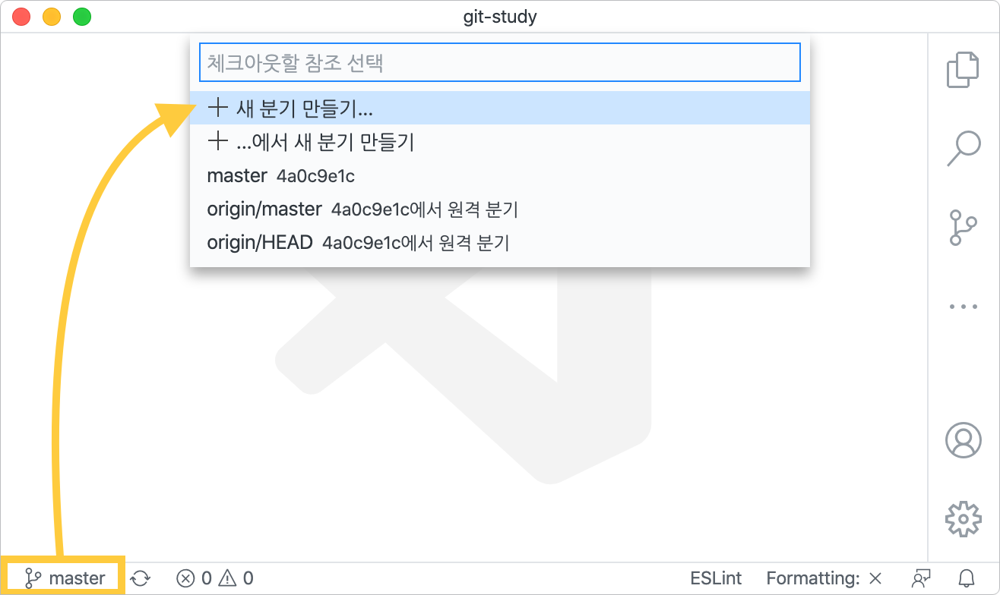
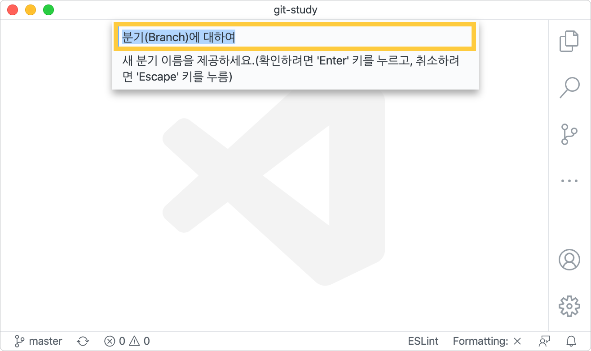
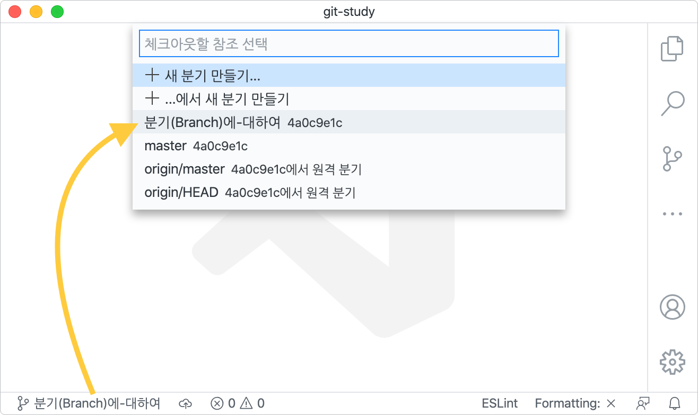
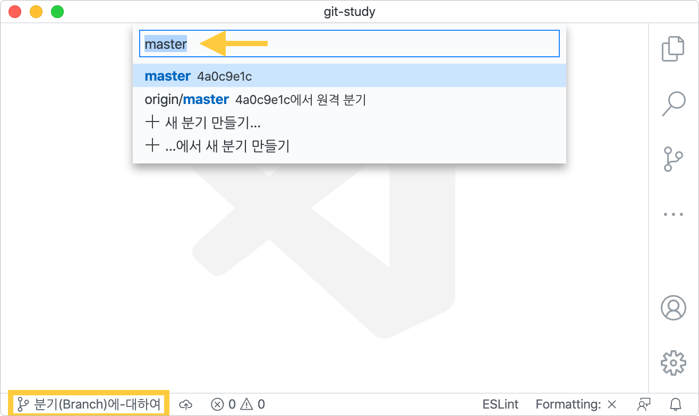
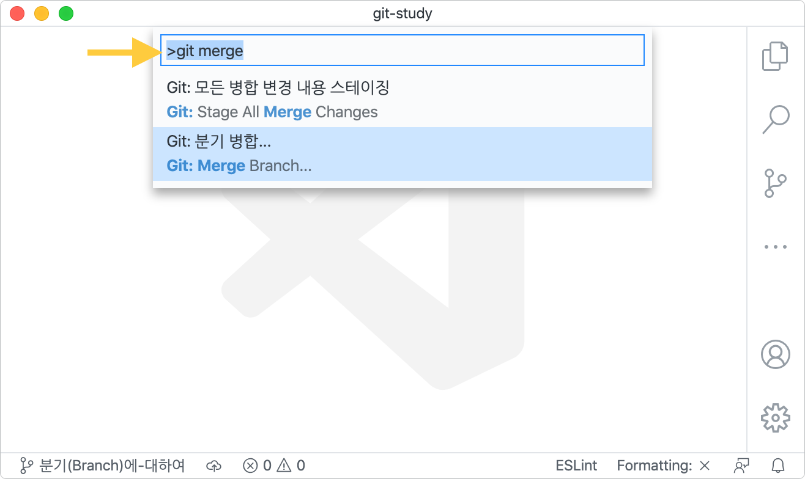
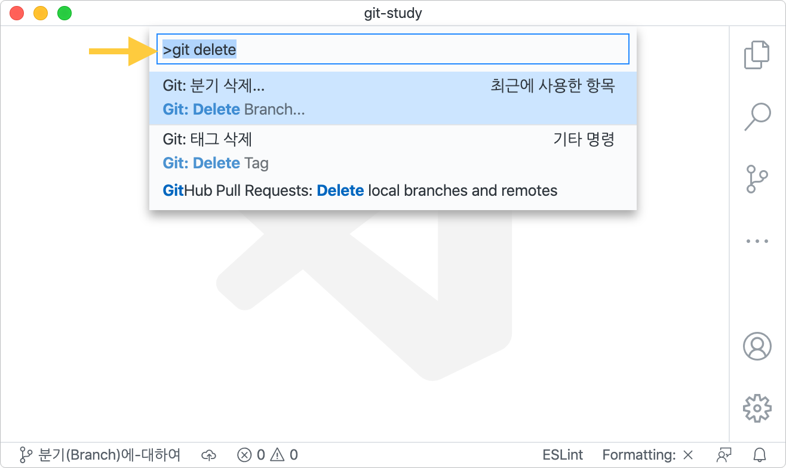

[← 뒤로](./README.md)

#  Git 버전 관리 에센셜 PART 07

Git을 사용해 프로젝트 버전 관리하는 방법을 살펴봅니다. CLI와 GUI 환경에서 Git을 사용하는 방법을 비교해봅니다.

<a href="https://bit.ly/GIT_ESSENTIAL" target="_blank"></a>

<!-- ----------------------------------------------------------------------- -->

##  브랜치 생성 및 조회하기

기존 코드와 분리해서 독립적으로 개발을 진행할 수 있도록 Git에서는 브랜치(Branch)라는 개념을 제공합니다. `master` 역시 브랜치이며 코드를 별도로 개발할 수 있는 영역인 새로운 브랜치를 생성할 수 있습니다.  브랜치의 생성 및 조회는 `branch` 명령을 사용합니다.

#### CLI 명령어 환경 —

`branch` 명령 또는 `switch -c` 명령을 사용해 독립된 브랜치를 생성할 수 있습니다. 이때 `switch -c` 명령은 Git 2.23 버전 이후부터 사용이 가능합니다.  

```sh
$ git branch <브랜치명> 
$ git switch -c <브랜치명>
```

`branch` 명령을 사용해 현재 Git이 관리하는 프로젝트 내 브랜치를 조회할 수 있습니다. 
```sh
$ git branch
```

#### GUI 그래픽 환경 —

VS Code 에디터의 왼쪽 하단 `master` 버튼을 클릭하면 명령어 팔레트가 화면에 표시되며 `+ 새 분기 만들기...` 또는 
`+ ...에서 새 분기 만들기` 명령을 선택해 새로운 브랜치를 생성할 수 있습니다.



새로운 브랜치(가치) 이름을 작성하고 실행하면 새로운 브랜치가 만들어 집니다.



브랜치가 생성된 이후에는 VS Code 왼쪽 하단에 신규 브랜치 이름이 표시되며, 생성된 브랜치는 고유 해시 값을 가집니다.




<br>

<!-- ----------------------------------------------------------------------- -->

##  브랜치로 이동하기

브랜치로 이동하기 위해서는 Git 2.23 버전 이전은 `checkout` 명령을 Git 2.23 버전은 `checkout` 또는 `switch` 명령을 사용할 수 있습니다. 

#### CLI 명령어 환경 —

브랜치로 이동하기 위해서는 `checkout` 또는 `switch` 명령을 사용할 수 있습니다.

```sh
$ git checkout <브랜치명>
$ git switch <브랜치명>
```

#### GUI 그래픽 환경 —

VS Code 왼쪽 하단 브랜치 이름을 클릭하면 명령어 팔레트가 표시되며 브랜치 이름을 찾거나, 입력하여 실행하면 브랜치가 변경됩니다.



<br>
<!-- ----------------------------------------------------------------------- -->

##  브랜치 병합하기

브랜치 병합은 `merge` 명령어로 실행합니다. 예를 들어 버그 해결을 위해 별도로 `bugfix` 브랜치를 생성하고 개발을 완료한 경우 이를 `master` 브랜치에 병합하고자 할 경우 우선 `master` 브랜치로 이동 후 `bugfix` 브랜치를 병합하면 됩니다.  

#### CLI 명령어 환경 —

`merge` 명령을 사용해 특정 브랜치를 다른 브랜치에 병합할 수 있습니다. 

```sh
$ git merge <브랜치명>
```

#### GUI 그래픽 환경 —

VS Code 메뉴 → 보기 → 명령어 팔레트(`F1`)를 띄운 후, `git merge` 명령을 입력하여 실행하면 브랜치를 병합할 수 있습니다.



<br>
<!-- ----------------------------------------------------------------------- -->

##  브랜치 삭제하기

독립된 브랜치에 개발한 코드를 `master` 브랜치에 병합한 후 기존 브랜치를 제거하고자 할 경우 `branch -d` 또는 `branch --delete` 명령을 사용합니다. 그러나 작업 내용이 남아있는 경우에는 브랜치를 삭제할 수 없을 것입니다. 이때는 브랜치를 강제로 삭제하여야 하며 브랜치를 강제로 삭제하기 위해서는 `branch -D` 명령을 사용해야 합니다. 

#### CLI 명령어 환경 —

`branch -d`, `branch --delete`, `branch -D` 명령을 사용해 특정 브랜치를 삭제할 수 있습니다. 

```sh
$ git branch -d <브랜치명>
$ git branch --delete <브랜치명>
$ git branch -D <브랜치명>
```

#### GUI 그래픽 환경 —

VS Code 메뉴 → 보기 → 명령어 팔레트(`F1`)를 띄운 후, `git delete` 명령을 입력하고 `Git 분기 삭제(Delete Branch)...` 명령을 찾아 실행하면 브랜치를 제거할 수 있습니다.



<br>
<!-- ----------------------------------------------------------------------- -->
